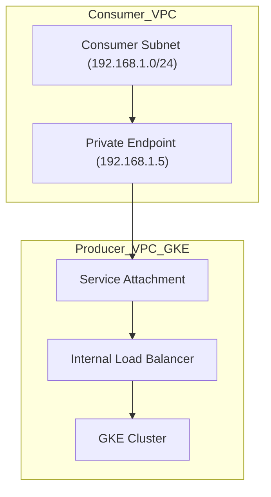
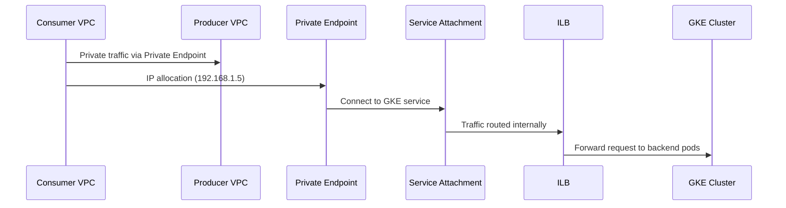
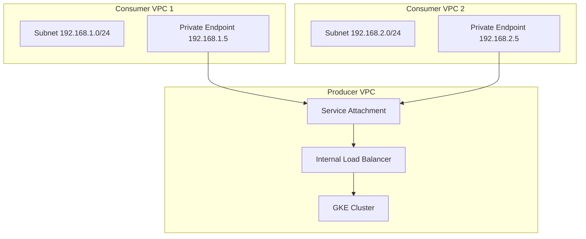

### **GCP Private Service Connect (PSC) with GKE**

---

### **What is GCP Private Service Connect (PSC)?**
**Private Service Connect (PSC)** allows secure, private communication between a **consumer's VPC** and a **producer's service** (e.g., an application running on **Google Kubernetes Engine (GKE)**). PSC ensures that traffic remains entirely within Google’s private network, avoiding exposure to the public internet.

---

### **Key Components of PSC**

| **Component**            | **Description**                                                                                                                                       |
|---------------------------|-------------------------------------------------------------------------------------------------------------------------------------------------------|
| **Service Attachment**    | A private "entry point" created by the producer's GKE cluster. It resides **behind the backend of the Internal Load Balancer (ILB)** and enables private connections. |
| **Private Endpoint**      | A private IP allocated in the consumer's subnet, connecting directly to the producer's Service Attachment.                                             |
| **Subnet**                | A range of private IPs in the consumer VPC, reserved for Private Endpoint allocation.                                                                |
| **Internal Load Balancer (ILB)**| Exposes the GKE service privately within the producer's VPC and handles traffic routed from the Service Attachment.                              |
| **Firewall Rules**        | Rules to allow traffic between the Private Endpoint and the producer's Service Attachment.                                                           |

---

### **Where Do Service Attachments and Private Endpoints Reside?**

- **Service Attachment**: 
  - Created in the **producer’s VPC**.
  - It resides **behind the backend of the ILB**.
  - **Purpose**: Acts as a private entry point for traffic originating from Private Endpoints in consumer VPCs.

- **Private Endpoint**:
  - Created in the **consumer’s VPC**.
  - Allocates a private IP from the reserved subnet and connects directly to the Service Attachment.

---

### **How Does PSC Work?**

#### **Producer Workflow (GKE)**:
1. The producer creates an application in GKE.
2. The application is exposed using an **Internal Load Balancer**.
3. A **Service Attachment** is created on the backend of the ILB, enabling consumers to connect privately.

#### **Consumer Workflow**:
1. The consumer reserves a **subnet** in their VPC for Private Endpoint allocation.
2. A **Private Endpoint** is allocated from the subnet, mapping to the Service Attachment.
3. **Firewall Rules** are configured to allow traffic between the Private Endpoint and the Service Attachment.

---

### **Routing Flow with Attachments and Endpoints**

| **Step** | **Component**                  | **Description**                                                                                              |
|----------|--------------------------------|--------------------------------------------------------------------------------------------------------------|
| **1**    | **Consumer Subnet**            | The consumer reserves a private subnet (e.g., `192.168.1.0/24`) to allocate Private Endpoints.               |
| **2**    | **Private Endpoint**           | A private IP (e.g., `192.168.1.5`) is allocated in the subnet and connects to the producer’s Service Attachment. |
| **3**    | **Service Attachment**         | A private entry point created by the ILB in the producer’s VPC.                                              |
| **4**    | **Internal Load Balancer (ILB)**| Routes traffic from the Service Attachment to backend pods in the GKE cluster.                               |
| **5**    | **Firewall Rules**             | Configured in the consumer’s VPC to allow traffic between the Private Endpoint and Service Attachment.        |

---

### **Diagrams for Better Understanding**

#### **High-Level Architecture**



---

#### **Detailed PSC Routing**



---

### **How to Set Up PSC with GKE**

#### **Producer (GKE)**

1. **Deploy GKE Application**:
   - Deploy the application and expose it via Kubernetes service:
   ```yaml
   apiVersion: v1
   kind: Service
   metadata:
     name: my-gke-service
     annotations:
       cloud.google.com/load-balancer-type: "Internal"
   spec:
     ports:
       - port: 80
         targetPort: 8080
     selector:
       app: my-app
     type: LoadBalancer
   ```

2. **Enable Service Attachment**:
   - Update the backend service to create a Service Attachment:
   ```bash
   gcloud compute network-endpoint-groups update my-neg \
       --psc-service-attachment \
       --region=us-central1
   ```

---

#### **Consumer**

1. **Reserve a Subnet**:
   - Reserve a private subnet for PSC Endpoints:
   ```bash
   gcloud compute networks subnets create psc-subnet \
       --range=192.168.1.0/24 \
       --network=my-vpc \
       --region=us-central1
   ```

2. **Create Private Endpoint**:
   - Map the Private Endpoint to the Service Attachment:
   ```bash
   gcloud compute forwarding-rules create psc-endpoint \
       --network=my-vpc \
       --subnet=psc-subnet \
       --address=192.168.1.5 \
       --target-service-attachment=projects/producer-project-id/regions/us-central1/serviceAttachments/my-service
   ```

3. **Configure Firewall Rules**:
   - Allow traffic from the Private Endpoint to the Service Attachment:
   ```bash
   gcloud compute firewall-rules create allow-psc-traffic \
       --network=my-vpc \
       --allow tcp:80 \
       --source-ranges=192.168.1.0/24
   ```

---

### **Adding New Consumers: Dynamic and Scalable**

#### **Is Redeployment Required?**
- **No**, redeployment is not required.
- The Service Attachment is a reusable, dynamic resource that can handle multiple consumers.

#### **How New Consumers Are Added Dynamically**

1. **Service Attachment Remains Static**:
   - The producer’s Service Attachment is configured once and can accept connections from new consumers without any changes.

2. **Consumer-Side Configuration**:
   - Each new consumer performs the following steps in their VPC:
     - Reserve a subnet for Private Endpoints.
     - Create a Private Endpoint pointing to the producer’s Service Attachment.
     - Configure Firewall Rules to allow traffic.

3. **Traffic Isolation**:
   - Each consumer’s Private Endpoint is independent, ensuring isolated and secure traffic.

#### **Multiple Consumers Workflow**



---

### **Monitoring and Managing Multiple Consumers**

1. **Check Active Connections**:
   - Use the following command to view all connected consumers:
   ```bash
   gcloud compute service-attachments describe my-service-attachment --region=us-central1
   ```

2. **Sample Output**:
   ```plaintext
   name: my-service-attachment
   region: us-central1
   connectedEndpoints:
     - psc-endpoint-ip: 192.168.1.5
       consumerProjectId: consumer-project-id-1
     - psc-endpoint-ip: 192.168.2.5
       consumerProjectId: consumer-project-id-2
   targetService: projects/producer-project-id/regions/us-central1/backendServices/my-ilb-backend-service
   ```

---

### **Challenges and Solutions**

| **Challenge**          | **Solution**                                                                                               |
|-------------------------|-----------------------------------------------------------------------------------------------------------|
| **Subnet Exhaustion**   | Allocate a larger subnet (e.g., `/24` or `/16`) for Private Endpoints.                                     |
| **IP Conflicts**        | Ensure non-overlapping IP ranges between consumer and producer networks.                                   |
| **Firewall Issues**     | Verify firewall rules allow traffic on required ports (e.g., TCP 80/443).                                 |
| **Quota Limits**        | Monitor quotas for PSC Endpoints and Service Attachments; request increases if necessary.                 |
| **Latency**             | Deploy PSC Endpoints in the same region as the producer’s Service Attachment to minimize latency.         |

---

### **Comparing GCP Private Service Connect (PSC) with Shared VPC for Large Enterprises**

---

### **Overview of PSC and Shared VPC**

| **Feature**                  | **Private Service Connect (PSC)**                                          | **Shared VPC**                                              |
|-------------------------------|---------------------------------------------------------------------------|------------------------------------------------------------|
| **Purpose**                   | Connect consumers to producer services privately and securely.            | Share a centralized VPC (host project) with multiple service projects. |
| **Traffic Flow**              | Consumer communicates via **Private Endpoints** mapped to **Service Attachments**. | Services directly connect within the Shared VPC.            |
| **Security Boundary**         | Consumer and producer maintain separate VPCs with controlled connections. | All projects operate under the same centralized VPC.        |
| **Scalability**               | Easily supports multi-consumer environments without redeployment.         | Limited by shared network design and overlapping IP conflicts. |
| **Management Complexity**     | Simplified for isolated connections, but requires subnet and endpoint setup per consumer. | Complex to manage as the network scales across multiple projects. |

---

### **Why PSC is Better for Large Enterprises**

#### **1. Isolation and Security**

| **PSC**                                                               | **Shared VPC**                                                   |
|------------------------------------------------------------------------|-------------------------------------------------------------------|
| **Strong Isolation**: Consumer VPCs are completely isolated from the producer’s VPC. Each consumer connects via **Private Endpoint**. | **Less Isolation**: All projects are connected to the **same VPC**, increasing the blast radius of misconfigurations or attacks. |
| **Controlled Access**: The producer controls which consumers can connect via **Service Attachments**. | **Open Access**: Once part of the Shared VPC, projects typically have fewer granular controls.       |
| **Private IPs**: PSC traffic never leaves Google’s private network and avoids overlapping IP conflicts. | Shared IP ranges across projects can lead to conflicts as the organization scales. |

---

#### **2. Scalability**

| **PSC**                                                               | **Shared VPC**                                                   |
|------------------------------------------------------------------------|-------------------------------------------------------------------|
| **Dynamic Consumer Addition**: Adding a new consumer doesn’t require producer changes. The Service Attachment handles multiple endpoints dynamically. | **Manual Expansion**: Adding new service projects often involves reconfiguring the Shared VPC and subnets. |
| **Region Flexibility**: PSC endpoints and Service Attachments can operate across regions (if required). | **Regional Limitation**: Shared VPCs are confined to a single region. Scaling across regions adds complexity. |

---

#### **3. Operational Simplicity**

| **PSC**                                                               | **Shared VPC**                                                   |
|------------------------------------------------------------------------|-------------------------------------------------------------------|
| **Producer-Consumer Separation**: Clear producer-consumer boundaries simplify troubleshooting and access management. | **Centralized Management Overhead**: Admins must oversee a shared routing table, firewall rules, and subnet allocations for all projects. |
| **Independent Networks**: Each consumer manages their own VPC without worrying about producer-side configurations. | **Tightly Coupled Networks**: Issues in one project can cascade across other projects due to shared infrastructure. |

---

### **Why PSC is Ideal for Large Enterprises**

#### **Global Scale**:
- Large enterprises operate globally, requiring regionally distributed services. PSC supports flexible, isolated connections between regional consumers and producers.

#### **Multi-Consumer Environment**:
- Enterprises often have multiple teams (e.g., sales, operations, IT) that consume services independently. PSC allows each team to maintain its own VPC while securely connecting to shared services.

#### **Security-First Design**:
- PSC ensures traffic isolation and minimizes the blast radius of misconfigurations. Shared VPC’s open model poses a higher risk in large-scale environments.

#### **Ease of Onboarding New Consumers**:
- With PSC, adding a new consumer (e.g., a partner or internal team) doesn’t require changes to the producer's Service Attachment. Consumers simply configure their Private Endpoint.

#### **IP Management**:
- PSC avoids the complexities of overlapping IP ranges across teams by leveraging isolated Private Endpoints.

---

### **How to Explain PSC vs. Shared VPC**

#### **Key Analogy**
- **PSC**: Think of PSC as a **secure mailbox system**:
  - **Service Attachment**: A private mailbox created by the producer.
  - **Private Endpoint**: Each consumer gets their own mailbox key, ensuring secure and isolated access.
  - The producer manages mail delivery, and consumers only access their mail.
  
- **Shared VPC**: Think of Shared VPC as a **shared office workspace**:
  - All teams operate in the same office, share infrastructure, and have fewer boundaries. While convenient, mismanagement in one area can disrupt others.

---

### **Memorable Points to Explain**

1. **Security and Isolation**:
   - PSC ensures each consumer and producer maintain independent networks, minimizing risks.
   - Shared VPC creates interdependencies that can lead to cascading failures.

2. **Scalability**:
   - Adding new consumers in PSC is **dynamic and requires no redeployment** from the producer.
   - In Shared VPC, new projects require network reconfiguration and careful IP management.

3. **Flexibility**:
   - PSC supports multi-region and hybrid setups (e.g., integrating external partners).
   - Shared VPC is tied to a single region and scales poorly across globally distributed teams.

4. **Management Overhead**:
   - PSC simplifies operations by isolating responsibilities. Shared VPC demands centralized management and monitoring.

---

### **Final Recommendation**

For a **large, globally distributed enterprise**, **PSC** is the preferred solution because it offers:

- **Dynamic scalability** for adding new consumers without redeployment.
- **Granular security** through isolated Private Endpoints and Service Attachments.
- **Simplified operations**, avoiding the centralized management burden of a Shared VPC.

This makes PSC ideal for environments with multiple teams, regions, or third-party integrations. Let me know if you'd like further help designing a PSC architecture tailored to your enterprise! 🚀