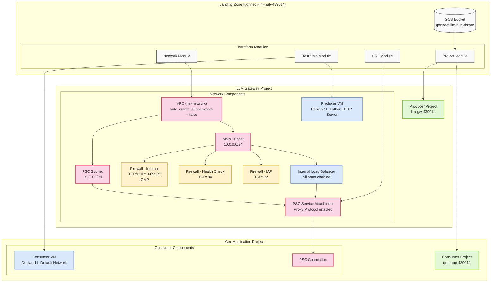

# LLM Landing Zone - Infrastructure Documentation

## Architecture Overview



## Project Configuration
```
Base Project Details:
- Project ID: gonnect-llm-hub-439014
- Project Number: 142589141949
- Billing Account: 01292F-9DB8C9-FA0207
- Region: us-central1
- Zone: us-central1-a
```

## Directory Structure
```
llm-landing/
├── environments/
│   └── dev/
│       ├── backend.tf        # GCS backend configuration
│       ├── main.tf          # Module configurations
│       ├── outputs.tf       # Project and resource outputs
│       ├── provider.tf      # Google provider setup
│       ├── terraform.tfvars # Variable definitions
│       └── variables.tf     # Variable declarations
├── modules/
│   ├── network/            # Network configuration
│   │   ├── main.tf        # VPC, subnets, firewall rules
│   │   ├── outputs.tf     # Network IDs and self_links
│   │   └── variables.tf   # Network variables
│   ├── project/           # Project creation
│   │   ├── main.tf        # Project and API enablement
│   │   ├── outputs.tf     # Project IDs
│   │   └── variables.tf   # Project variables
│   ├── psc/               # Private Service Connect
│   │   ├── main.tf        # PSC configuration
│   │   ├── outputs.tf     # PSC endpoints
│   │   └── variables.tf   # PSC variables
│   └── test_vms/          # Test instances
│       ├── main.tf        # VM configurations with IAP
│       ├── outputs.tf     # VM IPs
│       └── variables.tf   # VM variables
└── scripts/
    └── cleanup.sh         # Resource cleanup
```

## Initial Setup

### 1. Environment Preparation
```bash
# Create project structure
mkdir -p llm-landing/{environments/dev,modules/{network,project,psc,test_vms},scripts}
cd llm-landing

# Configure authentication
gcloud auth login
gcloud auth application-default login
gcloud config set project gonnect-llm-hub-439014

# Create state bucket
gsutil mb -p gonnect-llm-hub-439014 gs://gonnect-llm-hub-tfstate
```

### 2. API Enablement
```bash
# Enable required APIs in base project
gcloud services enable \
  cloudresourcemanager.googleapis.com \
  compute.googleapis.com \
  servicenetworking.googleapis.com \
  iam.googleapis.com \
  serviceusage.googleapis.com \
  iap.googleapis.com \
  oslogin.googleapis.com \
  --project gonnect-llm-hub-439014
```

### 3. IAP and OS Login Setup
```bash
# Set environment variables
export USER_EMAIL=$(gcloud config get-value account)

# Generate SSH key if needed
ssh-keygen -t rsa -f ~/.ssh/google_compute_engine -C $USER_EMAIL

# Configure OS Login
gcloud compute project-info add-metadata \
    --metadata enable-oslogin=TRUE \
    --project gonnect-llm-hub-439014

# Add SSH key to OS Login
gcloud compute os-login ssh-keys add \
    --key-file ~/.ssh/google_compute_engine.pub
```

### 4. Deployment
```bash
cd environments/dev
terraform init
terraform plan
terraform apply -auto-approve
```

## Access Configuration

### 1. Set Environment Variables
```bash
export LLM_PROJECT=$(terraform output -raw llm_gateway_project_id)
export GEN_PROJECT=$(terraform output -raw gen_app_project_id)
```

### 2. Configure IAP Access
```bash
# Grant IAP permissions
gcloud projects add-iam-policy-binding $LLM_PROJECT \
    --member="user:$USER_EMAIL" \
    --role="roles/iap.tunnelResourceAccessor"

gcloud projects add-iam-policy-binding $GEN_PROJECT \
    --member="user:$USER_EMAIL" \
    --role="roles/iap.tunnelResourceAccessor"

# Grant OS Login permissions
gcloud projects add-iam-policy-binding $LLM_PROJECT \
    --member="user:$USER_EMAIL" \
    --role="roles/compute.osLogin"

gcloud projects add-iam-policy-binding $GEN_PROJECT \
    --member="user:$USER_EMAIL" \
    --role="roles/compute.osLogin"
```

## Verification Steps

### 1. Project Verification
```bash
# Verify projects and APIs
gcloud projects list --filter="project_id:$LLM_PROJECT OR project_id:$GEN_PROJECT"
gcloud services list --project=$LLM_PROJECT --enabled
```

### 2. Network Verification
```bash
# Verify VPC and subnets
gcloud compute networks list --project=$LLM_PROJECT
gcloud compute networks subnets list --project=$LLM_PROJECT

# Check all firewall rules
gcloud compute firewall-rules list --project=$LLM_PROJECT

# Verify IAP firewall rule
gcloud compute firewall-rules describe allow-iap --project=$LLM_PROJECT
```

### 3. PSC Verification
```bash
# Check service attachments
gcloud compute service-attachments list \
    --project=$LLM_PROJECT \
    --regions=us-central1

# Verify forwarding rules
gcloud compute forwarding-rules list \
    --project=$LLM_PROJECT \
    --regions=us-central1

# Check backend services
gcloud compute backend-services list \
    --project=$LLM_PROJECT \
    --regions=us-central1
```

### 4. VM Verification
```bash
# Check VM configurations
gcloud compute instances list \
    --project=$LLM_PROJECT \
    --zones=us-central1-a

# Verify VM metadata and tags
gcloud compute instances describe producer-vm \
    --project=$LLM_PROJECT \
    --zone=us-central1-a \
    --format="table(tags.items,networkInterfaces[0].network,metadata.items)"
```

## Testing

### Producer VM Testing
```bash
# Connect through IAP
gcloud compute ssh producer-vm \
    --project=$LLM_PROJECT \
    --zone=us-central1-a \
    --tunnel-through-iap

# Verify HTTP server
curl localhost:80
```

### Consumer VM Testing
```bash
# Connect through IAP
gcloud compute ssh consumer-vm \
    --project=$GEN_PROJECT \
    --zone=us-central1-a \
    --tunnel-through-iap

# Test PSC connection
curl http://$(terraform output -raw psc_service_attachment)
```

Since terraform will not accessible inside the VM, the following steps are required to access the VM:
```bash
cd environments/dev
export PSC_ENDPOINT=$(terraform output -raw psc_service_attachment)
echo "PSC Endpoint: $PSC_ENDPOINT"

# Connect to consumer VM
gcloud compute ssh consumer-vm \
    --project=$GEN_PROJECT \
    --zone=us-central1-a \
    --tunnel-through-iap

# Once inside the VM, use the endpoint you noted
curl http://<paste_the_psc_endpoint_here>
```

or

```bash
# From your local machine, execute the curl command directly on the VM
gcloud compute ssh consumer-vm \
    --project=$GEN_PROJECT \
    --zone=us-central1-a \
    --tunnel-through-iap \
    --command="curl http://$(terraform output -raw psc_service_attachment)"
```


## Troubleshooting Guide

### IAP Connection Issues
```bash
# Test with troubleshooting output
gcloud compute ssh producer-vm \
    --project=$LLM_PROJECT \
    --zone=us-central1-a \
    --tunnel-through-iap \
    --troubleshoot

# Verify IAP permissions
gcloud projects get-iam-policy $LLM_PROJECT \
    --flatten="bindings[].members" \
    --format='table(bindings.role)' \
    --filter="bindings.members:$USER_EMAIL"
```

### Network Issues
```bash
# Check VM tags
gcloud compute instances describe producer-vm \
    --project=$LLM_PROJECT \
    --zone=us-central1-a \
    --format="get(tags.items)"

# Verify all network components
gcloud compute networks subnets list \
    --project=$LLM_PROJECT \
    --filter="network:llm-network"
```

### PSC Issues
```bash
# Check health check status
gcloud compute health-checks describe llm-health-check \
    --project=$LLM_PROJECT

# Verify service attachment
gcloud compute service-attachments describe llm-psc-attachment \
    --project=$LLM_PROJECT \
    --region=us-central1
```

## Security Notes

1. Network Security
- IAP-secured SSH access
- Private connectivity through PSC
- No public IP exposure
- Network tags for granular firewall control

2. Access Control
- OS Login enabled
- IAP tunnel authentication
- Project-level separation
- Least privilege IAM roles

## Cleanup Process
```bash
# Remove IAP permissions first
gcloud projects remove-iam-policy-binding $LLM_PROJECT \
    --member="user:$USER_EMAIL" \
    --role="roles/iap.tunnelResourceAccessor"

# Execute cleanup script
cd ../../scripts
chmod +x cleanup.sh
./cleanup.sh

# Verify cleanup
gcloud projects list
gsutil ls gs://gonnect-llm-hub-tfstate
```

## Monitoring and Health Checks

### 1. Service Health
```bash
# Check backend service health
gcloud compute backend-services get-health llm-producer-backend \
    --project=$LLM_PROJECT \
    --region=us-central1
```

### 2. VM Status
```bash
# Monitor VM status
gcloud compute instances get-serial-port-output producer-vm \
    --project=$LLM_PROJECT \
    --zone=us-central1-a
```

### 3. Network Connectivity
```bash
# Test internal connectivity
gcloud compute networks diagnose \
    --project=$LLM_PROJECT \
    --network=llm-network
```